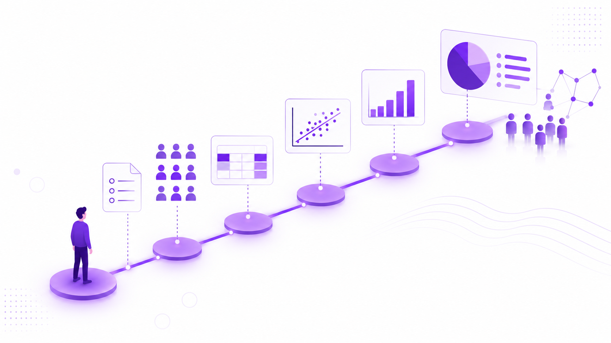

Este taller busca acompañarnos en los primeros pasos —pero primeros en serio— del análisis de datos con R.

La idea es empezar desde cero: preparar el entorno, cargar una base, mirar qué forma tiene, transformarla un poco y usarla para responder preguntas.

## ¿Qué vas a aprender?

Vamos a trabajar sobre cuatro pasos:

- **Primero**, cómo preparar un entorno para usar R.
- **Segundo**, cómo cargar y explorar un dataset.
- **Tercero**, cómo manipular y transformar una tabla para crear nuevas variables y grupos de datos, y visualizarlo con gráficos.
- **Cuarto**, cómo responder preguntas de investigación

## ¿Cómo vamos a trabajar?

El taller combina materiales asincrónicos y encuentros sincrónicos de apoyo por Meet/Zoom.

Los materiales quedan disponibles para que puedas recorrerlos a tu ritmo, repetir los ejercicios y volver al código cuando lo necesites.

En los encuentros vamos a retomar dudas, revisar ejemplos y acompañar el trabajo práctico.

## ¿Con qué vamos a trabajar?

Técnicamente, vamos a trabajar con una instalación de R que corre en la nube, llamado **Posit Cloud**.

Para ejercitarnos, vamos a usar un subconjunto anonimizado de una encuesta sobre actitudes, creencias y usos de inteligencia artificial en población adulta de Argentina.

La pregunta que nos va a guiar es:

> ¿Una actitud favorable hacia la inteligencia artificial implica confianza en sus capacidades concretas?

A partir de esa pregunta vamos a explorar una idea central: la aceptación de la IA no es homogénea, sino situada. Puede haber una valoración general positiva y, al mismo tiempo, dudas o rechazos frente a usos específicos.

## ¿Qué necesitás saber antes?

No hace falta experiencia previa en programación. Sí hace falta cierta disposición a probar, equivocarse, leer errores y volver a intentar. El objetivo es empezar a pensar de esta manera:

> tengo una pregunta, tengo un dataset, ¿qué operaciones necesito hacer para construir una respuesta?

## ¿Dé donde viene todo esto?

Estos materiales forman parte de una línea de trabajo orientada a acompañar la enseñanza y el aprendizaje de las ciencias sociales computacionales.

Los desarrollamos a partir de experiencias docentes en la [Licenciatura en Sociología de UFLO](https://www.uflouniversidad.edu.ar/carrera/sociologia/) y en la [Diplomatura en Ciencias Sociales Computacionales de UFLO y UCA](https://uca.edu.ar/es/cursos-de-educacion-continua/facultad-de-ciencias-sociales/diplomatura/diplomatura-en-ciencias-sociales-computacionales-nivel-introductorio).

La idea de fondo es simple: acercar herramientas computacionales al trabajo de las ciencias sociales sin perder de vista las preguntas, los problemas y las formas de interpretación propias de nuestras disciplinas. De hecho, creemos que las Ciencias Sociales Computacionales son un espacio ideal para la reflexión epistemológica y la mirada crítica de la Sociología, y por eso los invitamos a aprender análisis de datos o programar.

Otros materiales abiertos, elaborados en estos espacios se encuentran disponibles en nuestro sitio web **[Recursos Sociológicos](https://www.recursossociologicos.ar/)**. 

Allí vas a encontrar:

- 📚 **tutoriales y guías** para seguir practicando con R, datos y herramientas digitales;
- 🎥 **clases abiertas, conversatorios y podcasts** sobre sociología, IA y ciencias sociales computacionales;
- 🧪 **proyectos de investigación** desarrollados en nuestros espacios de trabajo;
- 🛠️ **herramientas y desarrollos abiertos** para apoyar distintas tareas de investigación social;
- 📰 **publicaciones y materiales de divulgación** vinculados con sociología, tecnología e inteligencia artificial.
