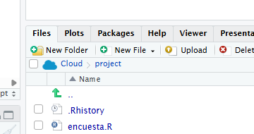

## Objetivo

En este primer módulo vamos a preparar el entorno de trabajo, familiarizarnos con R y Posit.Cloud, y cargar nuestro primer dataset.

Puntualmente, vamos a ver:

- qué es R;
- cómo usarlo en la nube;
- cómo utilizar una interfaz de trabajo;
- cómo cargar un archivo .csv;
- cómo hacer una primera inspección de nuestra tabla.

## ¿Qué es R?

R es un lenguaje de programación para análisis de datos y computación científica. Es una herramienta libre, gratuita y multiplataforma. Podés acceder a la página del proyecto por acá: [The R Project for Statistical Computing](#0).

Para usar R y RStudio hay dos caminos:

1.  instalar R y RStudio en nuestra computadora;
2.  usar una versión en la nube desde el navegador.

En este taller vamos a ir por la segunda opción, y vamos a usar [Posit.Cloud con plan gratuito](https://posit.cloud/plans/free).

Pero, si te interesa usar R para proyecto más grandes o con datos que no querés subir a una nube, tenés que descargarte R e instalarla tu computadora, a través de [CRAN: El archivo oficial de R](https://cran.r-project.org/mirrors.html).

## ¿Qué es un IDE? / ¿Qué es RStudio?

R puede usarse directamente desde una consola. Sin embargo, para trabajar de manera más cómoda solemos usar un programa adicional: un entorno integrado de desarrollo (IDE, en inglés) que nos ofrece una interfaz visual y herramientas para facilitar la escritura y ejecución del código.

Entre los posibles IDEs para R, vamos a usar **RStudio**, el cual se encuentra disponible en Posit.Cloud.

Si estás trabajando en local, podés descargar gratuitamente [RStudio versión escritorio](https://posit.co/downloads/).

En Posit.CLoud, un **proyecto** es la unidad de trabajo, donde se reúne código, datos, y archivos en un mismo espacio. Hay distintos tipo de Proyectos, pero aquí vamos a usar RStudio.


Guía oficial: [Get Started with Posit Cloud](https://docs.posit.co/cloud/get_started/).

## La interfaz de RStudio

Cuando se abre RStudio, la pantalla se organiza en paneles.


Los cuatro paneles principales son:

| Panel           | Para qué sirve                                            |
|------------------|------------------------------------------------------|
| **Source**      | Escribir y guardar código en scripts (archivos de texto)  |
| **Console**     | Ejecutar comandos de R y mostrar resultados / respuestas  |
| **Environment** | Ver objetos cargados en memoria                           |
| **Output**      | Ver archivos, gráficos, paquetes, ayuda y visualizaciones |

Guía oficial: [RStudio User Guide - Pane Layout](https://docs.posit.co/ide/user/ide/guide/ui/ui-panes.html).

## Cargar archivos

En este proyecto vamos a leer una base directamente desde internet, de modo que no necesitamos subir archivos al proyecto. Pero, si querés trabajar con una planilla o dataset que tenés en local, la podes importar desde la tab de `Files` que está en el panel de Outputs:



## Nuestro primer código

Para empezar, vamos a escribir y ejecutar algunas instrucciones simples en R.

En RStudio podemos ejecutar código de dos maneras:

1.  escribiendo directamente en la **Console**;
2.  escribiendo en un **script** y ejecutando línea por línea.

En este taller vamos a usar scripts, porque nos permiten guardar el código, corregirlo y volver a ejecutarlo más adelante.

Para crear un script nuevo:

``` text
File > New File > R Script
```

También se puede usar el botón de archivo nuevo en la parte superior izquierda de RStudio.

Una vez abierto el script, escribimos:

``` r
2 + 2
```

Para ejecutar esa línea, ubicamos el cursor sobre ella y usamos:

``` text
Ctrl + Enter
```

También podemos hacer clic en el botón **Run**. El resultado aparece en la **Console**:

``` r
[1] 4
```

R también nos permite guardar valores en objetos (variables), utilizando el operador de asignación `<-` .

``` r
mi_numero <- 10
mi_otro_numero <- 15
mi_texto <- "Hola, R"
```

Cuando ejecutamos este código, el objeto aparece en el panel **Environment**. Ese panel muestra los objetos que tenemos cargados en memoria durante la sesión de trabajo.

Luego, podemos ver estos objetos, u operar sobre ellos.

``` r
mi_numero # si no hacemos nada, se muestra en pantalla
mi_texto

mi_numero > mi_otro_numero # si hacemos una operacion muestra el resultado

mi_nuevo_numero <- mi_numero + mi_otro_numero # o podemos guardar el resultado de una operación en una variable nueva
mi_nuevo_numero
```

## Trabajar con paquetes

R viene con muchas funciones básicas, pero para trabajar con datos solemos usar paquetes adicionales. Un **paquete** es un conjunto de funciones, datos y herramientas que amplían lo que podemos hacer con R.

En este taller vamos a usar principalmente el paquete `tidyverse`, que reúne varias herramientas para leer, transformar, analizar y graficar datos.

Para instalarlo, ejecutamos:

``` r
install.packages("tidyverse")
```

También vamos a instalar `janitor`, que sirve para algunas tareas simples de limpieza de datos:

``` r
install.packages("janitor")
```

La instalación se hace una sola vez en cada entorno de trabajo.

## Cargar paquetes

Después de instalar un paquete, hay que cargarlo en la sesión de R para poder usarlo.

``` r
library(tidyverse)
library(janitor)
```

Esta operación sí hay que repetirla cada vez que iniciamos una nueva sesión o abrimos nuevamente el proyecto. Una forma práctica de organizar el script es empezar siempre cargando los paquetes que vamos a usar:

``` r
library(tidyverse)
library(janitor)
```
