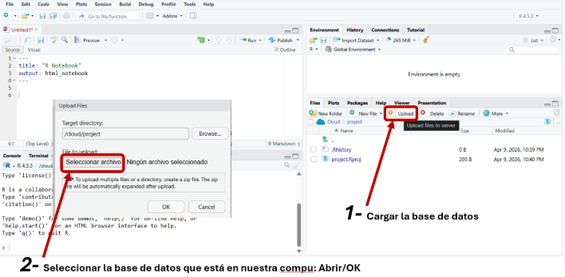
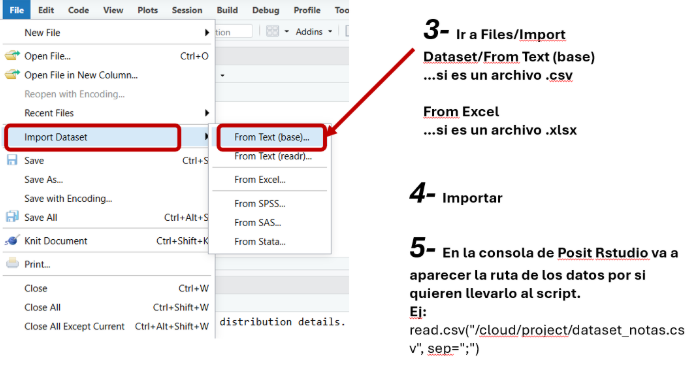
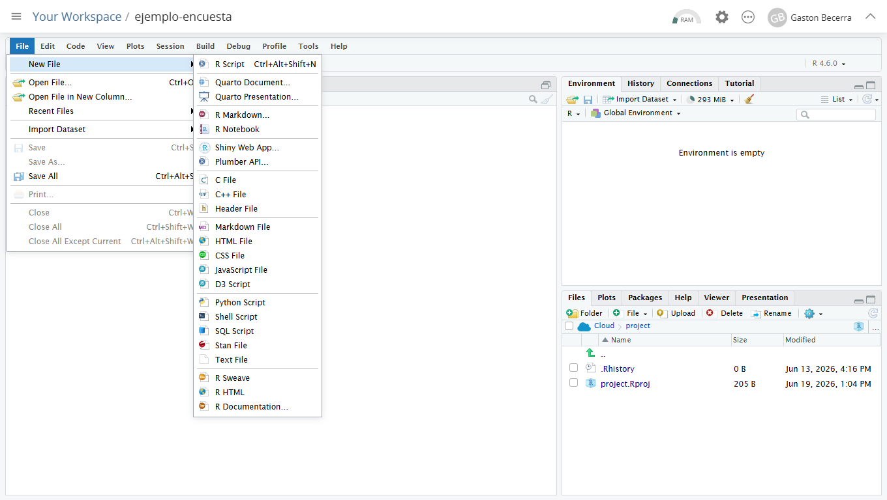
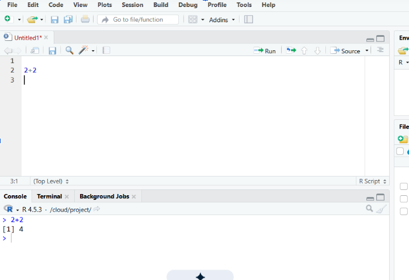
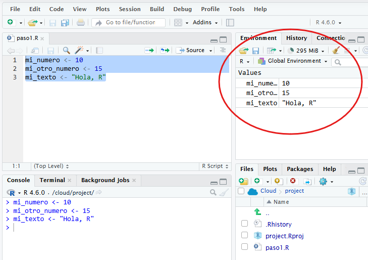
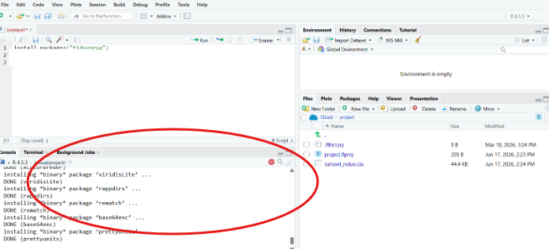

## Objetivo

En este primer paso vamos a preparar el entorno de trabajo y familiarizarnos con R y Posit.Cloud. 

Puntualmente, vamos a ver:

- qué es R y RStudio;
- organizar el trabajo en proyectos;
- cómo utilizar la interfaz de Rstudio;
- cómo cargar paquetes.

## ¿Qué es R? ¿Qué es RStudio?

R es un lenguaje de programación para análisis de datos y computación científica. Es una herramienta libre, gratuita y multiplataforma. Podés acceder a la página del proyecto por acá: [The R Project for Statistical Computing](https://www.r-project.org/).

Para usar R y RStudio hay dos caminos:

1.  usar una versión en la nube (**Posit Cloud**) desde el navegador,
2.  instalar **R** y **RStudio** en nuestra computadora.

**En este taller vamos a ir por la primera opción, y vamos a usar [Posit.Cloud con plan gratuito](https://posit.cloud/plans/free) que ya viene con un entorno listo para ejecutar R, y con RStudio versión web, que se ve y se usa igual que la versión desktop.**

Pero, si te interesa usar R para proyecto más grandes o con datos que no querés subir a una nube, tenés que descargar e instalar 2 programas, en el siguiente orden:

1. R for Windows / macOS / Linux a través de [CRAN: El archivo oficial de R](http://mirror.fcaglp.unlp.edu.ar/CRAN/),
2. RStudio desde la [https://posit.co/downloads](página de descargas de Posit). (Donde dice "Download Rstudio", y no "RStudio Server")

El primer programa (R) es es el lenguaje, lo que tu computadora va a llamar para ejecutar los análisis que vos le indiques. R puede usarse directamente desde su consola. Sin embargo, para trabajar de manera más cómoda solemos usar un programa adicional: un entorno integrado de desarrollo (IDE, en inglés) que nos ofrece una interfaz visual y herramientas para facilitar la escritura y ejecución del código. Entre los posibles IDEs para R, recomendamos **RStudio**.

## ¿Cómo organizo mis proyectos?

En RStudio, conviene trabajar con **proyectos**: carpetas donde se reúnen los archivos de un análisis, los códigos para hacer el procesamiento, los archivos de datos, y otros documentos. 

Para crear un proyecto nuevo, entramos a Posit.Cloud y elegimos:

```text
New Project > New RStudio Project
```


Una vez creado, Posit.Cloud abre RStudio en el navegador. Todo lo que hagamos dentro de ese espacio queda asociado a ese proyecto.

En este taller vamos a leer una base directamente desde internet y guardarla en memoria, de modo que no necesitamos subir archivos al proyecto. Pero, si querés trabajar con una planilla o dataset que tenés en local, la podes importar desde la tab de `Files` que está en el panel de Outputs (esto lo tenés más abajo en ¿Como usar RStudio?)



Allí, primero tenés que subirlo a al nuevo. Luego, vas a tener que importar el dataset, a través de:

```text
File > Import Dataset > From ... y el formato de tu dataset
```



El archivo más común de un proyecto en un **R Script**, que es un archivo de texto donde escribimos nuestro código para realizar los análisis. Este tipo de archivos es el más básico: sólo código e instrucciones. No vamos a guardar los resultados del análisis en nuestro documento. Resultados, gráficos y otros objetos los vamos a consultar directamente de RStudio. 

Para generar un nuevo archivo de R Script vamos a ir a: 

```text
File > New File > R Script 
```



## ¿Cómo usar RStudio?

Cuando se abre RStudio, la pantalla se organiza en paneles.


Los cuatro paneles principales son:

| Panel           | Para qué sirve                                            |
|------------------|------------------------------------------------------|
| **Source**      | Escribir y guardar código en scripts                      |
| **Console**     | Ejecutar comandos de R y mostrar resultados / respuestas  |
| **Environment** | Ver objetos cargados en memoria                           |
| **Output**      | Ver archivos, gráficos, paquetes, ayuda y visualizaciones |

Guía oficial: [RStudio User Guide - Pane Layout](https://docs.posit.co/ide/user/ide/guide/ui/ui-panes.html).


## ¿Dónde va nuestro código?

Para empezar, vamos a escribir y ejecutar algunas instrucciones simples en R.

En RStudio podemos ejecutar código de dos maneras:

1.  escribiendo directamente en la **Console**;
2.  escribiendo en un **script** y ejecutando línea por línea.

En este taller vamos a usar scripts, porque nos permiten guardar el código, corregirlo y volver a ejecutarlo más adelante.

Una vez creado el script, escribimos:

``` r
2 + 2
```

Para ejecutar esa línea, ubicamos el cursor sobre ella y usamos:

``` text
Ctrl + Enter
```

También podemos hacer clic en el botón **Run**. El resultado aparece en la **Console**:

``` r
[1] 4
```




R también nos permite guardar valores en objetos (variables), utilizando el operador de asignación `<-` .

``` r
mi_numero <- 10
mi_otro_numero <- 15
mi_texto <- "Hola, R"
```

Cuando ejecutamos este código, el objeto aparece en el panel **Environment**. Ese panel muestra los objetos que tenemos cargados en memoria durante la sesión de trabajo.



Por cierto, ¿viste esa escobita en el panel de environment? Esto te permite borrar todo lo que tenés en memoria para empezar de nuevo.  

Para ver u operar estos objetos los vamos a llamar por su nombre en el código:

``` r
mi_numero # si escribimos el nombre del objeto, nos muestra su contenido o valores
mi_texto

mi_numero > mi_otro_numero # si hacemos una operacion muestra el resultado

mi_nuevo_numero <- mi_numero + mi_otro_numero # o podemos guardar el resultado de una operación en una variable nueva
mi_nuevo_numero
```

(Habrán notado que el código de arriba tiene comentarios. Estos son pedacitos de textos que no se ejecutan y nos permiten aclarar qué decisión tomamos en ese punto, o narrar nuestro razonamiento en ese momento. Un comentario es lo que sigue al signo `# texto del comentario`.)

Así como podemos crear objetos en memoria, podemos reescribirlos o actualizarlos, y también borrarlos.

``` r
numero_actualizar <- 5
numero_actualizar
numero_actualizar <- numero_actualizar + 5
numero_actualizar
rm(numero_actualizar) # lo borra de memoria
```

## ¿Qué son los paquetes?

R viene con muchas funciones básicas, pero para trabajar con datos solemos usar paquetes adicionales. Un **paquete** es un conjunto de funciones, datos y herramientas que amplían lo que podemos hacer con R.

En este taller vamos a usar principalmente el paquete `tidyverse`, que reúne varias herramientas para leer, transformar, analizar y graficar datos.

Para instalarlo, ejecutamos:

``` r
install.packages("tidyverse")
```

Cuando le damos Run o Control+Enter a las líneas donde pusimos la indicación de install.packeges (“tidyverse”) vamos a dejar que instale, esto puede demorar. Para saber que ha terminado de correr esperaremos que el botón rojo que aparece en la consola desaparezca.



La instalación se hace una sola vez en cada entorno de trabajo.

Después de instalar un paquete, hay que cargarlo en la sesión de R para poder usarlo.

``` r
library(tidyverse)
```

Esta operación sí hay que repetirla cada vez que iniciamos una nueva sesión o abrimos nuevamente el proyecto. 
