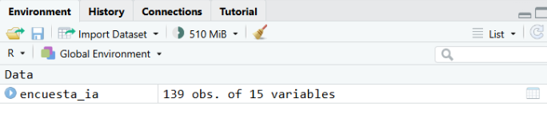
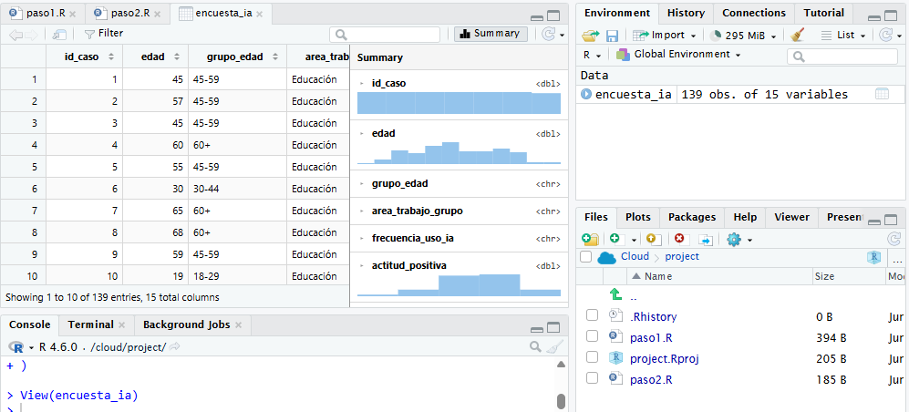

## Objetivo

En este pasito vamos a empezar a explorar una base de datos en R. Para el final, vas a poder cargar un dataset, reconocer su estructura, identificar sus variables principales y realizar primeras operaciones de inspección.

Trabajaremos con una base de datos construida a partir de una encuesta sobre actitudes, creencias y usos de inteligencia artificial.

## ¿Cómo cargamos los datos?

Antes de empezar a trabajar, cargamos los paquetes que vamos a usar:

```{r}
#| message: false
#| warning: false
library(tidyverse)
```

Para cargar los datos vamos a usar la función `read_csv()`. En R, una **función** es una instrucción que realiza una tarea específica: recibe cierta información entre paréntesis, la procesa y devuelve un resultado. La función `read_csv()`, por ejemplo, sirve para leer archivos `.csv` y viene incluida en el paquete `readr`, que forma parte del `tidyverse`.

```{r}
encuesta_ia <- read_csv(
  "https://raw.githubusercontent.com/gastonbecerra/primeros-pasos-r/refs/heads/main/data/encuesta_ia_subset.csv",
  show_col_types = FALSE
)
```

(Recordá que podés copiar este código de este tutorial con el botón de portapapeles, y que para correrlo tenés que pegarlo en tu Script y correrlo con Run o Control+Enter)

Con esta línea hacemos tres cosas:

1.  leemos un archivo `.csv` alojado en internet;
2.  lo cargamos en R;
3.  lo guardamos en un objeto llamado `encuesta_ia`.

Podemos ver que el objeto `encuesta_ia` aparece en el panel **Environment**. Ese panel nos muestra qué objetos tenemos disponibles durante la sesión de trabajo.



En R, un **objeto** es un nombre que usamos para guardar información en la memoria de trabajo. En este caso, `encuesta_ia` es un objeto que contiene una tabla de datos.

Más específicamente, `encuesta_ia` es un **tibble**: una versión moderna del `data.frame`, usada por el `tidyverse`, que organiza datos en filas y columnas, pero los muestra de forma más ordenada y compacta en la consola.

Si escribimos el nombre del objeto, R nos muestra una vista resumida de la tabla:

```{r}
encuesta_ia
```

En una tabla de datos:

- cada **fila** representa un caso u observación (una persona encuestada);
- cada **columna** representa una variable;
- cada **celda** contiene el valor de una variable para un caso.

## ¿Cuál es el tamaño de nuestra base?

Para conocer el tamaño de la tabla podemos usar `dim()`.

```{r}
dim(encuesta_ia)
```

Esta función devuelve dos números:

- el primero indica la cantidad de filas o casos, en nuestra tabla son 139;
- el segundo indica la cantidad de columnas o variables, que en nuestra tabla son 15.

También podemos consultar cada dimensión por separado con las funciones `nrow()` y `ncol()`.

```{r}
nrow(encuesta_ia)
```

```{r}
ncol(encuesta_ia)
```

## ¿Cómo vemos los datos?

Para mirar las primeras filas usamos `head()`.

```{r}
head(encuesta_ia)
```

Por defecto, `head()` muestra los primeros registros de la tabla.

Si queremos ver más filas, podemos indicarlo con el argumento `n`:

```{r}
head(encuesta_ia, n = 10)
```

Esto nos permite hacer una primera inspección rápida:

- ver nombres de columnas;
- mirar valores concretos;
- detectar si la tabla se cargó correctamente;
- reconocer cómo están codificadas algunas variables.

También podemos abrir la tabla en una vista similar a una planilla con `View()`.

``` r
View(encuesta_ia)
```

(Importante: R distingue mayúsculas y minúsculas. La función correcta es `View()` con **V mayúscula**.)

Esto abre una pestaña en RStudio donde podemos recorrer filas y columnas visualmente. Esto es útil para inspeccionar los datos, pero no reemplaza el código. Mirar la tabla ayuda a orientarnos; escribir código nos permite repetir, documentar y compartir el análisis.





## ¿Qué tipos de datos tenemos?

`glimpse()` muestra la estructura de la tabla de una forma compacta.

```{r}
glimpse(encuesta_ia)
```

Nos informa:

- cuántas filas tiene;
- cuántas columnas tiene;
- el nombre de cada variable;
- el tipo de dato de cada variable;
- algunos valores iniciales.

Así, podemos ver que en este dataset tenemos variables de tres tipos:

| Grupo de variables | Variables |
|------------------------------------|------------------------------------|
| Sociodemográficas | `edad`, `grupo_edad`, `area_trabajo_grupo`, `frecuencia_uso_ia`, generalmente con textos |
| Actitudes | empiezan con `actitud_` y tienen valores numéricos entre 1 y 5 |
| Creencias | empiezan con `creencia_` y tienen valores numéricos entre 1 y 5 |

## ¿Qué hay en nuestros datos?

Para tener unas primeras estadísticas de las numéricas, podemos pedir un `summary()`.

```{r, eval=FALSE}
summary(encuesta_ia)
```

Con esto podemos empezar a decir algo sobre nuestros datos. Sobre la variable `edad` podemos decir que la persona más joven tiene 19 años, la mayor tiene 74, y la edad promedio es aproximadamente 45 años. También podemos mirar los ítems de actitud y creencias. Como están medidos en una escala de 1 a 5, sus medias nos dan una primera orientación. En esta salida se observa que algunas variables de actitud tienen promedios relativamente altos, como `actitud_vida_cotidiana`, mientras que algunas creencias específicas tienen promedios más bajos, como `creencia_orientacion_psicologica`.

En cambio, para variables guardadas como texto, como `grupo_edad`, `area_trabajo_grupo` o `frecuencia_uso_ia`, `summary()` no nos da una distribución útil. Para esas variables conviene contar cuántos casos hay en cada categoría. Para eso usamos la función `count()`, que nos pide como primer argumento que le indiquemos un objeto, y luego que indiquemos qué variable (columna) queremos contar.

```{r}
count(encuesta_ia, grupo_edad)
```

También podemos contar las áreas de trabaj, o la frecuencia de uso de IA:

```{r}
count(encuesta_ia, area_trabajo_grupo)
count(encuesta_ia, frecuencia_uso_ia)
```

Estas tablas son simples, pero ya nos permiten empezar a describir la composición de la base. Por ejemplo, podemos ver si los grupos están equilibrados, si hay categorías con pocos casos, o si alguna respuesta concentra la mayor parte de la muestra. Ah! y también podemos contar dos columnas juntas, para cruzarlas:

```{r}
count(encuesta_ia, area_trabajo_grupo, frecuencia_uso_ia)
```
